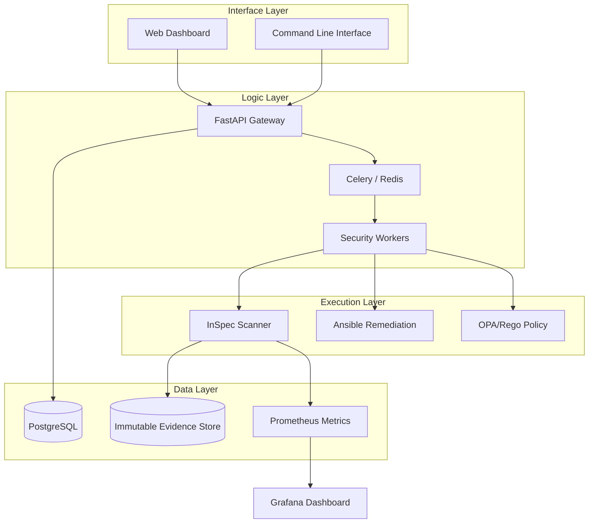

# 🛡️ COMPLIANCE-AS-CODE (CIS BENCHMARK FOR OPENSTACK & LINUX)


> **Giải pháp tự động hóa tuân thủ bảo mật (Compliance-as-Code) toàn diện cho hạ tầng Cloud OpenStack và hệ điều hành Linux theo tiêu chuẩn quốc tế CIS Benchmark.**

---

## 📖 Mục lục

1.  [💡 Giới thiệu](#-giới-thiệu)
2.  [✨ Tính năng & Độ phủ (Coverage)](#-tính-năng--độ-phủ-coverage)
3.  [🏗️ Kiến trúc hệ thống](#-kiến-trúc-hệ-thống)
4.  [🚀 Cài đặt & Makefile](#-cài-đặt--makefile)
5.  [🎬 Hướng dẫn Sử dụng (Demo & Live)](#-hướng-dẫn-sử-dụng-demo--live)
6.  [📊 Dashboard & Monitoring](#-dashboard--monitoring)
7.  [🔐 Hệ thống Minh chứng (Evidence)](#-hệ-thống-minh-chứng-evidence)
8.  [🏢 Nền tảng Enterprise (Backend API)](#-nền-tảng-enterprise-backend-api)
9.  [📄 Báo cáo & Kiểm toán](#-báo-cáo--kiểm-toán)
10. [🛠️ Khắc phục sự cố](#-khắc-phục-sự-cố)

---

## 💡 Giới thiệu

Trong kỷ nguyên Cloud, việc duy trì bảo mật không còn là một công việc thủ công định kỳ. **Compliance-as-Code** chuyển đổi các chính sách bảo mật văn bản (như CIS Benchmark) thành mã nguồn có thể thực thi, cho phép:
- **Phát hiện tức thì:** Quét hàng trăm cấu hình sai chỉ trong vài giây.
- **Tự động sửa lỗi:** Sử dụng Ansible để đưa hệ thống về trạng thái an toàn ngay lập tức.
- **Giám sát liên tục:** Không bao giờ để hệ thống rơi vào trạng thái không tuân thủ.

Dự án này được thiết kế theo tiêu chuẩn **Enterprise Cloud Security Engineer**, sẵn sàng cho các môi trường Ngân hàng, Viễn thông và Cloud Provider.

---

## ✨ Tính năng & Độ phủ (Coverage)

### 🛡️ Bảo mật tiêu chuẩn quốc tế
Chúng tôi cung cấp bộ kiểm soát (controls) đầy đủ cho OpenStack và Linux:

| Dịch vụ OpenStack | Số lượng Controls | Trạng thái |
|:---:|:---:|:---:|
| **Keystone (Identity)** | 10 | ✅ 100% |
| **Nova (Compute)** | 12 | ✅ 100% |
| **Neutron (Networking)** | 8 | ✅ 100% |
| **Cinder (Block Storage)** | 6 | ✅ 100% |
| **Glance (Image)** | 5 | ✅ 100% |
| **Horizon (Dashboard)** | 7 | ✅ 100% |
| **Heat (Orchestration)** | 5 | ✅ 100% |
| **Linux OS (Ubuntu/RHEL)** | 50+ | ✅ 100% |

### ⚡ Khả năng cốt lõi
- **InSpec Scanning:** Quét cấu hình runtime, permissions, và file ownership.
- **Ansible Remediation:** Tự động "vá" lỗi bảo mật thông qua Infrastructure-as-Code.
- **OPA/Rego Policies:** Kiểm tra tính tuân thủ của các file cấu hình YAML/JSON và template Heat/CloudFormation.
- **Drift Detection:** So sánh trạng thái hiện tại với **Baseline** để phát hiện thay đổi trái phép.

---

## 🏗️ Kiến trúc hệ thống

Hệ thống được thiết kế theo mô hình 3 lớp chuyên nghiệp, đảm bảo tính mở rộng và an toàn dữ liệu:



---

## 🚀 Cài đặt & Makefile

### Yêu cầu hệ thống
- **OS:** Linux (Ubuntu 20.04+) hoặc macOS.
- **Công cụ:** Python 3.10+, Docker, Git.

### Bước 1: Clone dự án
```bash
git clone https://github.com/vutd22uit/COMPLIANCE-AS-CODE.git
cd COMPLIANCE-AS-CODE
```

### Bước 2: Cài đặt tự động
Sử dụng Makefile để thiết lập môi trường cô lập (venv) và cài đặt dependencies:
```bash
make install
```

### Các lệnh Makefile quan trọng:
| Lệnh | Chức năng |
|:---|:---|
| `make scan` | Chạy quét ở chế độ Demo (tạo dữ liệu giả lập) |
| `make scan-live` | Chạy quét trên môi trường OpenStack thật |
| `make dashboard` | Khởi động stack Prometheus/Grafana |
| `make report` | Tạo báo cáo HTML/PDF chuyên nghiệp |
| `make baseline` | Lưu trạng thái hiện tại làm chuẩn (Baseline) |
| `make diff` | So sánh kết quả hiện tại với Baseline |

---

## 🎬 Hướng dẫn Sử dụng (Demo & Live)

### 1. Chế độ Trình diễn (Demo Mode)
Dành cho việc giới thiệu luồng hoạt động mà không cần hạ tầng thật:
```bash
python3 scripts/super_demo.py
```
Script này cho phép bạn:
- 🔴 **Giả lập Sự cố:** Tạo ra các cấu hình sai để Dashboard chuyển sang màu đỏ.
- 🟢 **Tự động sửa:** Kích hoạt Ansible để fix lỗi và đưa Dashboard về màu xanh.

### 2. Quét thực tế (Live Execution)
#### Thiết lập SSH Access
Hệ thống cần quyền truy cập SSH vào các nodes OpenStack (Controller/Compute):
```bash
# Thiết lập biến môi trường
export OPENSTACK_HOST="10.0.0.1"
export OPENSTACK_USER="ubuntu"
export OPENSTACK_KEY="~/.ssh/id_rsa"

# Chạy quét live
make scan-live
```

#### Tự động Remedy (Khắc phục)
Sử dụng Ansible Playbooks để sửa lỗi hàng loạt:
```bash
ansible-playbook remediation/ansible/playbooks/site.yml -i '10.0.0.1,' --tags keystone,nova
```

---

## 📊 Dashboard & Monitoring

Stack giám sát cung cấp khả năng quan sát thời gian thực về tình trạng tuân thủ.

### Kích hoạt Stack
```bash
make dashboard
```

### Thông tin truy cập:
- **Grafana:** [http://localhost:3000](http://localhost:3000) (`admin` / `openstack-cis-2024`)
- **Prometheus:** [http://localhost:9091](http://localhost:9091)
- **Cảnh báo (Alerts):** Tự động gửi thông báo qua Slack/Email khi Compliance Score < 80%.

---

## 🔐 Hệ thống Minh chứng (Evidence)

Mọi dữ liệu quét được lưu trữ theo tiêu chuẩn kiểm toán quốc tế (Audit-Ready):
- **Immutability:** Minh chứng được hash SHA-256 để đảm bảo không bị giả mạo.
- **Storage Path:** `evidence_store/{scanner}/{year}/{month}/{day}/`
- **KPIs:** Tự động tính toán MTTR (Mean Time to Remediate) và MTTD (Mean Time to Detect).

### Cách kiểm tra tính toàn vẹn:
```bash
# Xác thực hash của file minh chứng
bash evidence/scripts/verify-integrity.sh evidence_store/raw-scans/inspec/latest.json
```

---

## 🏢 Nền tảng Enterprise (Backend API)

Nền tảng hỗ trợ quản lý tập trung đa môi trường (Multi-tenant) thông qua REST API.

### Triển khai Backend
```bash
docker-compose -f docker-compose.enterprise.yml up -d
python backend/database/init_db.py
```

### Tài liệu API
Truy cập Swagger tại: [http://localhost:8000/docs](http://localhost:8000/docs)
- **RBAC:** Admin, Security Engineer, Auditor.
- **Task Queue:** Celery xử lý hàng nghìn job quét không đồng bộ.
- **Integrations:** Link trực tiếp với Jira để tạo ticket và Slack để báo động.

---

## 📄 Báo cáo & Kiểm toán

### Báo cáo LaTeX (PDF)
Dành cho báo cáo chính thức cấp lãnh đạo hoặc ban kiểm toán:
```bash
cd docs/report
pdflatex report.tex
```

### Báo cáo HTML
Báo cáo trực quan đi kèm với kết quả quét InSpec, hiển thị chi tiết từng dòng cấu hình vi phạm và hướng dẫn khắc phục.

---

## 🛠️ Khắc phục sự cố

1. **Lỗi `Permission denied`:** Đảm bảo user SSH có quyền `sudo` không cần mật khẩu (hoặc cấu hình `NOPASSWD`).
2. **Dashboard trống:** Kiểm tra `compliance-exporter` logs: `docker logs compliance-exporter`.
3. **Lỗi Python:** Đảm bảo đã chạy `make install` để cập nhật đầy đủ thư viện.

---

## 📞 Hỗ trợ & Đóng góp

Dự án được xây dựng với mục tiêu nâng tầm bảo mật Cloud tại Việt Nam.
- **Tác giả:** Team Capstone - Cloud Security Specialists.
- **Tiêu chuẩn:** Enterprise Grade.
- **GitHub:** [COMPLIANCE-AS-CODE](https://github.com/vutd22uit/COMPLIANCE-AS-CODE)

---
*Kiến tạo một hạ tầng Cloud an toàn và tuân thủ.*
