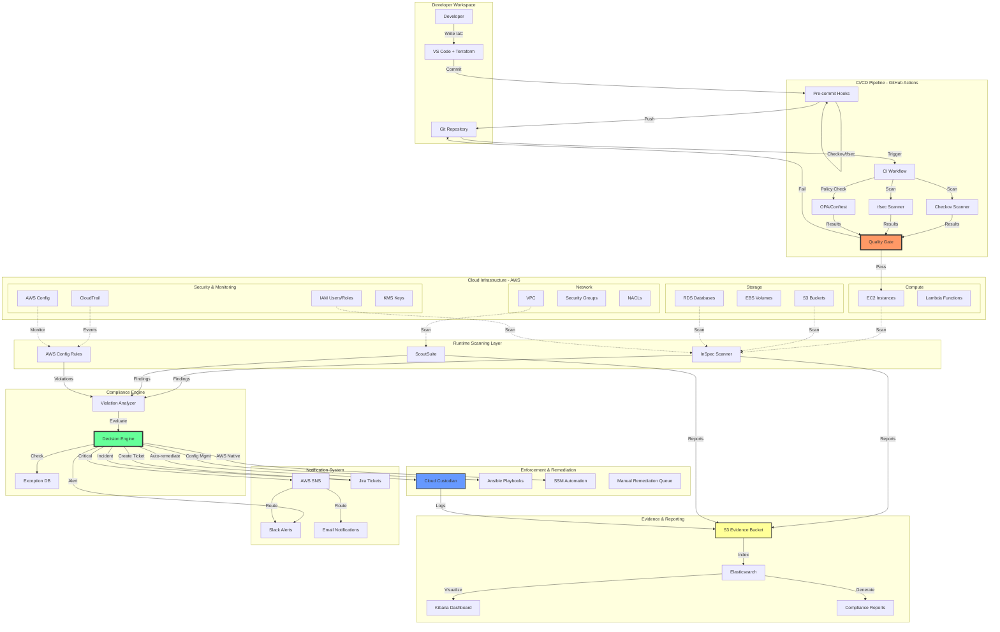
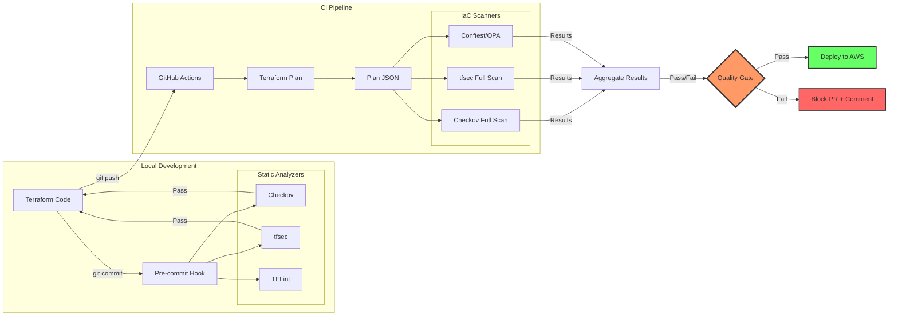
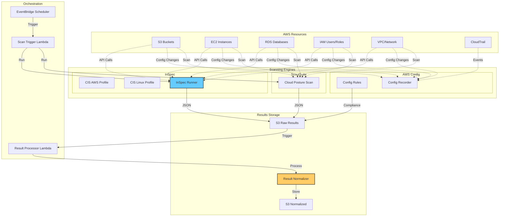
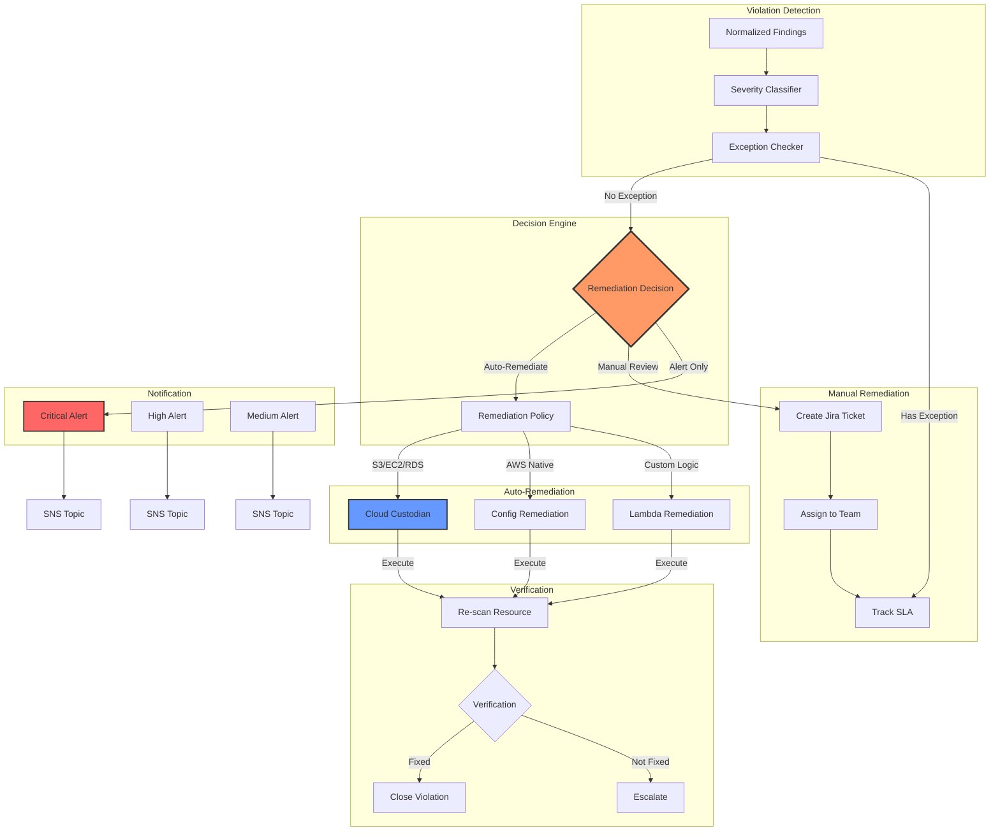
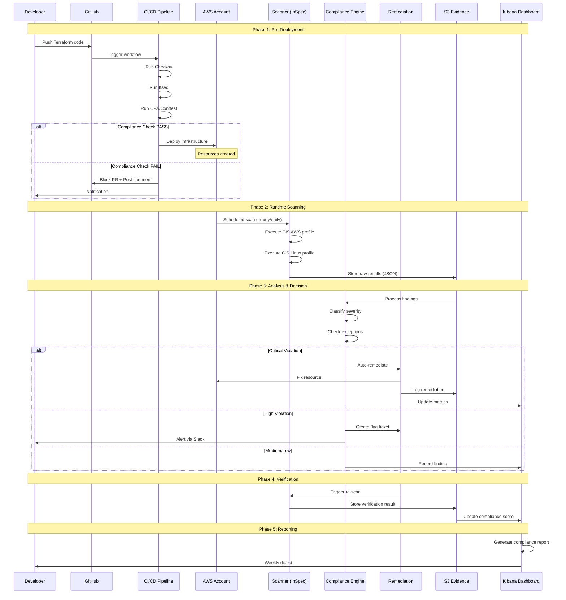
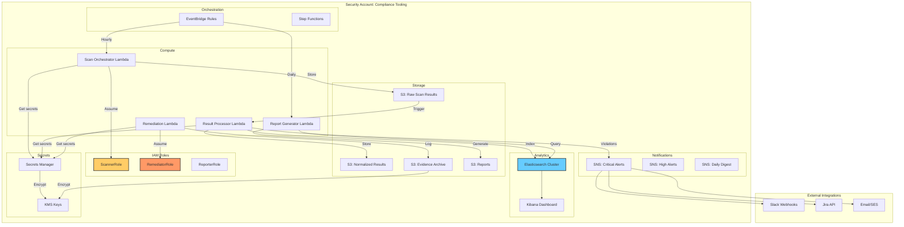
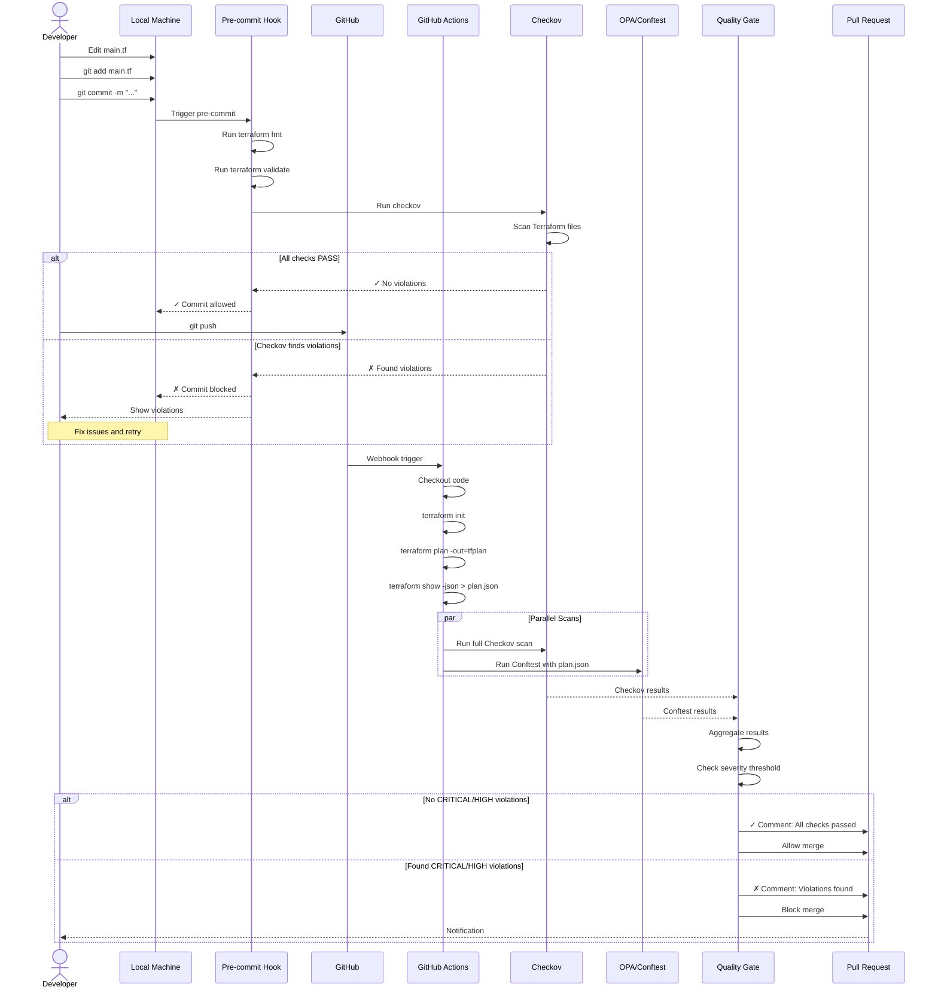
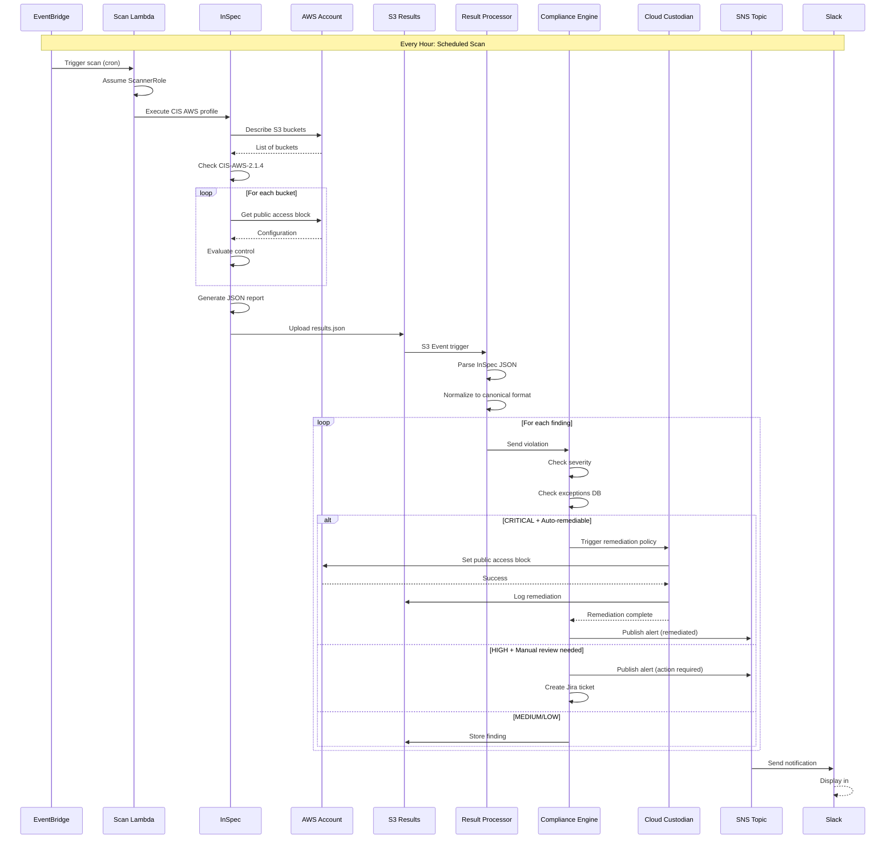
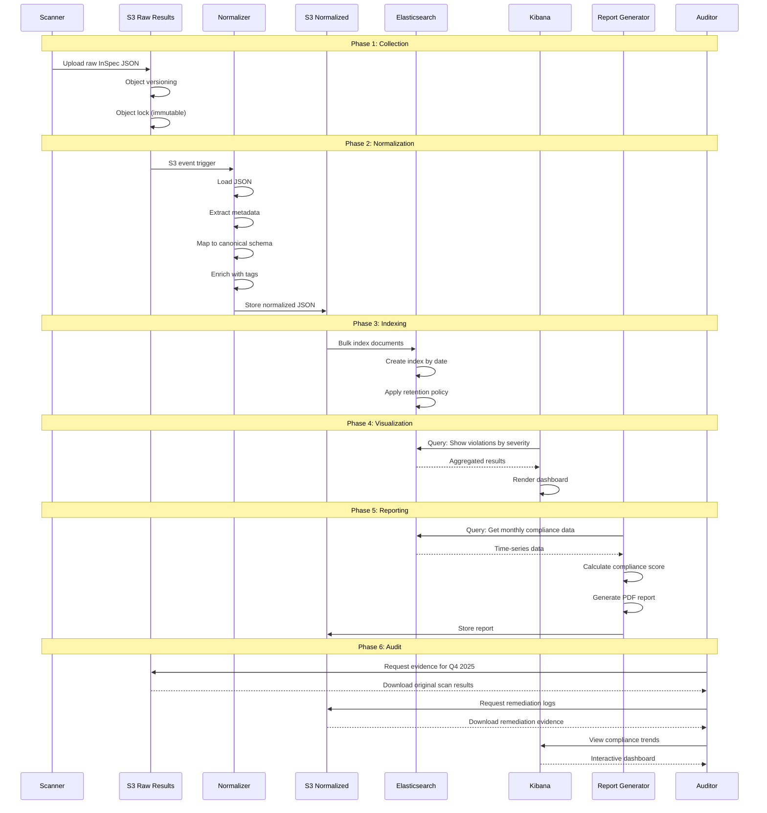

# System Architecture & Data Flow - CIS Benchmark Compliance Framework

## Table of Contents
- [1. High-Level System Architecture](#1-high-level-system-architecture)
- [2. Detailed Component Architecture](#2-detailed-component-architecture)
- [3. Data Flow Diagrams](#3-data-flow-diagrams)
- [4. Deployment Architecture](#4-deployment-architecture)
- [5. Sequence Diagrams](#5-sequence-diagrams)

---

## 1. High-Level System Architecture



---

## 2. Detailed Component Architecture

### 2.1 Pre-Deployment Layer



### 2.2 Runtime Monitoring Layer



### 2.3 Enforcement & Remediation Layer



---

## 3. Data Flow Diagrams

### 3.1 End-to-End Data Flow



### 3.2 Detailed Scan Data Flow

```mermaid
graph TB
    subgraph "1. Trigger"
        T1[EventBridge Schedule]
        T2[Manual Trigger]
        T3[Config Change Event]
    end

    subgraph "2. Scan Orchestrator"
        LAMBDA[Scan Orchestrator Lambda]
        PARAMS[Scan Parameters]
        TARGET[Target Selection]
    end

    subgraph "3. Scan Execution"
        subgraph "InSpec Scan"
            I1[Load CIS Profile]
            I2[Query AWS APIs]
            I3[Execute Controls]
            I4[Collect Results]
        end

        subgraph "Parallel: AWS Config"
            C1[Evaluate Rules]
            C2[Check Compliance]
        end
    end

    subgraph "4. Raw Results"
        R1[InSpec JSON Output]
        R2[Config Evaluation]
        S3RAW[S3://raw-results/]
    end

    subgraph "5. Normalization"
        N1[S3 Event Trigger]
        N2[Normalizer Lambda]
        N3[Schema Validation]
        N4[Enrichment]
    end

    subgraph "6. Canonical Format"
        JSON[Normalized JSON]
        SCHEMA{
            control_id: CIS-AWS-X.X
            resource_id: arn:aws:...
            status: PASS/FAIL
            severity: CRITICAL/HIGH/MEDIUM/LOW
            timestamp: ISO8601
            evidence: {...}
            remediation: {...}
        }
    end

    subgraph "7. Storage & Indexing"
        S3NORM[S3://normalized-results/]
        ES[Elasticsearch Index]
        PARTITION[Partition by date/severity]
    end

    subgraph "8. Analysis Pipeline"
        STREAM[Kinesis Stream]
        ANALYTICS[Lambda Analytics]
        AGGREGATOR[Metrics Aggregator]
    end

    T1 & T2 & T3 --> LAMBDA
    LAMBDA --> PARAMS
    PARAMS --> TARGET
    TARGET --> I1
    TARGET --> C1

    I1 --> I2 --> I3 --> I4 --> R1
    C1 --> C2 --> R2

    R1 & R2 --> S3RAW
    S3RAW --> N1
    N1 --> N2
    N2 --> N3
    N3 --> N4
    N4 --> JSON
    JSON -.->|Conforms to| SCHEMA
    JSON --> S3NORM
    S3NORM --> ES
    ES --> PARTITION

    S3NORM --> STREAM
    STREAM --> ANALYTICS
    ANALYTICS --> AGGREGATOR

    style SCHEMA fill:#ff9,stroke:#333,stroke-width:2px
    style LAMBDA fill:#6cf,stroke:#333,stroke-width:2px
    style N2 fill:#fc6,stroke:#333,stroke-width:2px
```

### 3.3 Remediation Data Flow

```mermaid
graph TB
    subgraph "Input: Violations"
        V1[S3 Public Bucket]
        V2[Unencrypted EBS]
        V3[Root Access Key]
        V4[No MFA on IAM]
        V5[Open Security Group]
    end

    subgraph "Classification"
        CLASS[Violation Classifier]
        SEV[Severity: CRITICAL]
        AUTO{Auto-remediable?}
        SAFE{Safe to auto-fix?}
    end

    subgraph "Decision Matrix"
        MATRIX{
            CRITICAL + Auto-remediable + Safe
            → Auto-remediate

            CRITICAL + Auto-remediable + Unsafe
            → Create ticket + Alert

            CRITICAL + Not auto-remediable
            → Alert + Ticket

            HIGH/MEDIUM
            → Ticket
        }
    end

    subgraph "Remediation Execution"
        subgraph "Cloud Custodian"
            CUS1[Load Policy]
            CUS2[Apply Filters]
            CUS3[Execute Action]
            CUS4[Verify]
        end

        subgraph "AWS Config"
            CFG1[SSM Automation Doc]
            CFG2[Execute Runbook]
            CFG3[Verify]
        end

        subgraph "Custom Lambda"
            LAM1[Custom Logic]
            LAM2[AWS SDK Calls]
            LAM3[Verify]
        end
    end

    subgraph "Verification & Evidence"
        VERIFY[Re-scan Resource]
        BEFORE[Before State]
        AFTER[After State]
        DIFF[State Diff]
        LOG[Remediation Log]
    end

    subgraph "Evidence Storage"
        EVD{
            remediation_id: uuid
            control_id: CIS-AWS-X.X
            resource_arn: arn:aws:...
            violation_detected: timestamp
            remediation_started: timestamp
            remediation_completed: timestamp
            method: custodian/config/lambda
            before_state: {...}
            after_state: {...}
            success: true/false
            triggered_by: auto/manual
        }
        S3EVD[S3://evidence/remediations/]
    end

    V1 & V2 & V3 & V4 & V5 --> CLASS
    CLASS --> SEV
    SEV --> AUTO
    AUTO -->|Yes| SAFE
    AUTO -->|No| MATRIX
    SAFE -->|Yes| MATRIX
    SAFE -->|No| MATRIX

    MATRIX -->|S3 Public| CUS1
    MATRIX -->|EBS Encryption| CFG1
    MATRIX -->|Custom Fix| LAM1

    CUS1 --> CUS2 --> CUS3 --> CUS4
    CFG1 --> CFG2 --> CFG3
    LAM1 --> LAM2 --> LAM3

    CUS4 & CFG3 & LAM3 --> VERIFY
    VERIFY --> BEFORE
    VERIFY --> AFTER
    BEFORE & AFTER --> DIFF
    DIFF --> LOG
    LOG -.->|Structure| EVD
    LOG --> S3EVD

    style MATRIX fill:#f96,stroke:#333,stroke-width:3px
    style EVD fill:#ff9,stroke:#333,stroke-width:2px
    style VERIFY fill:#6f9,stroke:#333,stroke-width:2px
```

---

## 4. Deployment Architecture

### 4.1 AWS Multi-Account Setup

```mermaid
graph TB
    subgraph "AWS Organization"
        ORG[Management Account]

        subgraph "Security Account"
            SEC[Security Tooling]
            SCANNER[Scanner IAM Role]
            REMEDIATE[Remediation IAM Role]
            S3SEC[Evidence S3 Bucket]
            ELASTIC[Elasticsearch Domain]
            KIBANA[Kibana]
        end

        subgraph "Production Account"
            PROD[Production Workloads]
            PRODRES[AWS Resources]
            PRODLOG[CloudTrail]
            PRODCONF[AWS Config]
        end

        subgraph "Staging Account"
            STAGE[Staging Workloads]
            STAGERES[AWS Resources]
            STAGELOG[CloudTrail]
            STAGECONF[AWS Config]
        end

        subgraph "Development Account"
            DEV[Development Workloads]
            DEVRES[AWS Resources]
            DEVLOG[CloudTrail]
            DEVCONF[AWS Config]
        end
    end

    subgraph "CI/CD Account"
        GITHUB[GitHub Actions Runner]
        CICD[CI/CD Pipeline]
    end

    ORG -->|Manages| SEC
    ORG -->|Manages| PROD
    ORG -->|Manages| STAGE
    ORG -->|Manages| DEV

    %% Scanner role assumes into each account
    SCANNER -.->|AssumeRole| PRODRES
    SCANNER -.->|AssumeRole| STAGERES
    SCANNER -.->|AssumeRole| DEVRES

    %% Remediation role
    REMEDIATE -.->|AssumeRole + Fix| PRODRES
    REMEDIATE -.->|AssumeRole + Fix| STAGERES
    REMEDIATE -.->|AssumeRole + Fix| DEVRES

    %% Logs flow to security account
    PRODLOG -->|Aggregate| S3SEC
    STAGELOG -->|Aggregate| S3SEC
    DEVLOG -->|Aggregate| S3SEC

    %% Config to Elasticsearch
    PRODCONF -->|Findings| ELASTIC
    STAGECONF -->|Findings| ELASTIC
    DEVCONF -->|Findings| ELASTIC

    %% CI/CD deploys
    CICD -->|Deploy| PROD
    CICD -->|Deploy| STAGE
    CICD -->|Deploy| DEV

    style SEC fill:#f96,stroke:#333,stroke-width:3px
    style SCANNER fill:#6cf,stroke:#333,stroke-width:2px
    style REMEDIATE fill:#fc6,stroke:#333,stroke-width:2px
```



### 4.2 Security Account Detail



---

## 5. Sequence Diagrams

### 5.1 Pre-Deployment Compliance Check



### 5.2 Runtime Scan & Remediation



### 5.3 Evidence Collection & Reporting



---

## Summary

### Key Architecture Principles

1. **Defense in Depth**: Multiple layers (pre-deploy, runtime, remediation)
2. **Immutable Evidence**: All scan results stored with versioning and object lock
3. **Automated Remediation**: Safe fixes applied automatically, risky ones require approval
4. **Real-time Monitoring**: Continuous scanning and alerting
5. **Audit-Ready**: Complete evidence trail with timestamps and signatures

### Data Flow Summary

```
Terraform Code
    → Pre-commit Hooks (Local)
    → CI/CD Pipeline (Checkov/OPA)
    → Quality Gate
    → Deploy to AWS

AWS Resources
    → Runtime Scan (InSpec/Config)
    → Raw Results (S3)
    → Normalization
    → Compliance Engine
    → Auto-remediation / Alerts
    → Evidence Storage
    → Dashboard / Reports
```

### Critical Components

1. **Scanner IAM Role**: Cross-account read-only access
2. **Remediation IAM Role**: Specific write permissions per service
3. **Evidence S3 Bucket**: Versioned, encrypted, object-locked
4. **Elasticsearch**: Centralized compliance data store
5. **Cloud Custodian**: Auto-remediation engine

---

**Document Version**: 1.0
**Last Updated**: 2025-12-07
**Focus**: CIS Benchmark (AWS + Linux)
